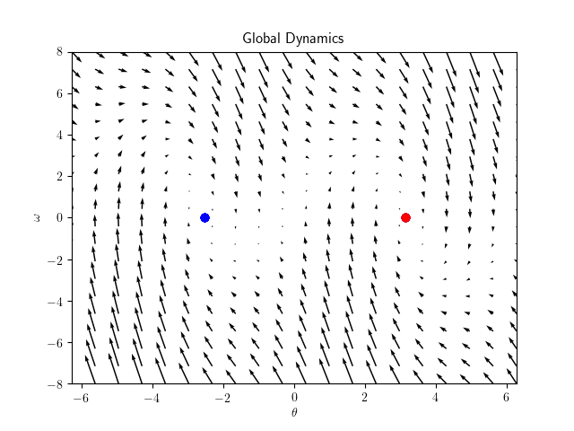
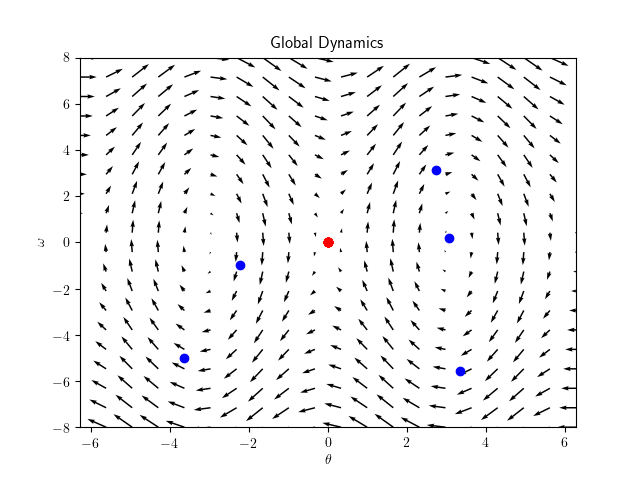
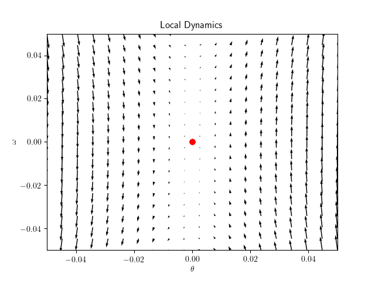
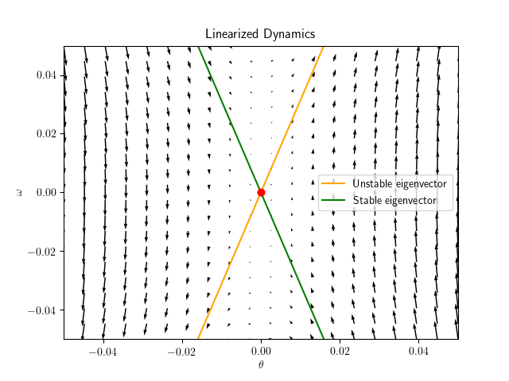

VisualizeDynamicalSystem
=======================

__Author__: Samuele Tosatto  
__Personal Email__: `samuele.tosatto@gmail.com`  
__Institutional Email__: `samuele.tosatto@uibk.ca.at`  
__Institution__: Universitaet Innsbruck

TL;DR
-----

This software allows to visualize the dynamics of 2D dynamical systems. This little package contains only a simple 
1-link robot arm and Lotka-Volterra but can be extended with other systems as well.

Using `visualize.py` is possible to render the phase plot of the dynamical system, 
compute and visualize trajectories, and analyze the (linear) stability of an equilibrium point

Visualize phase + trajectories
-----------------------------

Use either `visualizer.gif_trajectory` or `visualizer.show_trajectory` where `visualizer` is an object of the class `VisualizeDynamics2D`.
A few examples:




Linearization and stability
---------------------------
The method `linearize` provided by the class `VisualizeDynamicalSystems2D` returns 3 objects:
1. a linearized system (belonging to the class `DynamicalSystem` defined in `dynamic_systems.py`)
2. a list of eigenvalues and
3. a list of eigenvectors.  

The class also outputs in the console an analysis of the linearized system. An example:


```commandline
Input of robot_link_controller_visualize.py

Insert Desired Theta: 0.
Insert Gravitational Compensation: 0.
Insert Proportional Term: 0.
Insert Derivative Term: 0.
```

Resulting output:

```commandline
Linear system analysis: Saddle equilibrium
        
Eigenvalue1: 3.132092
Eigenvector1: [ 0.30414954 -0.30414954]
        
Eigenvalue2: -3.132092
Eigenvector2: [0.9526243 0.9526243]      
        
Trace: 0.000000
Determinant: -9.810000
Delta: 39.240002
```

A visualization of the linear system and its eigenvector can be done by calling `visualize_eigenvectors`.
An example of a possible output is:




1-Link Robot Manipulator
------------------------

The class `RobotLink` defines a robotic arm composed by a single link with mass `m` length `l` and gravitational acceleration `g`.
The system can be actuated by using a PD controller with gravitational compensation.

The "gravitational compensation" term (`K0`) allows to make sure that a desired configuration `theta_d` is an equilibrium point. This term is actually different from classic gravitational compensation, since this method only compensate the gravity for a desired robot configuration `theta`. Can the student write a classic gravitational compensation that work simultaneously for all configuration? How this compensation term affect the stability of `K1` and `K2`?
The proportional term (`K1`) inputs a torque proportional to the error between the desired angle and the current one  
The derivative term (`K2`) inputs a torque proportional to the derivative of the error  

You can play with different settings to see how the angular velocity `omega` and the angle `theta` change in time.

Of course, you can write your own controller too! :) 

Extensions
----------

By taking inspiration from 1-link robot arm and Lotka-Volterra, you can write your own (2D) system and render it!


